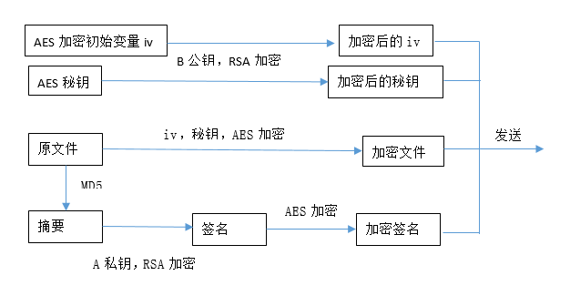
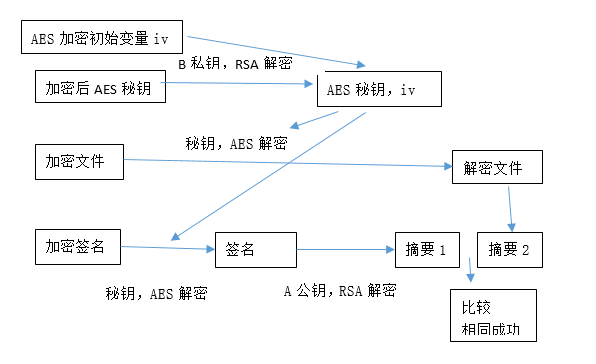

# AES-RSA-FileTransfer  

## 0x00 简介  
**windows下用AES，RSA来实现文件的加密安全传输**  
具体使用python的`pycrypto`、`m2crypto`两个模块来实现  

## 0x01 大概思路  
Alice拥有： AES秘钥，Bob公钥，Alice的私钥  
Bob拥有：Alice的公钥，Bob的私钥   

大概思路就是Alice先用AES加密文件，然后拿Bob的RSA公钥加密AES秘钥；  
Bob接收到加密文件之后，用自己的RSA私钥解密出AES秘钥，再解密文件。  
另外还有MD5签名，可以验证文件的完整性  

## 0x02 流程图  
Alice加密流程图:enc.png  
  
Bob解密流程图：dec.png  
  


## 0x03 实际加解密流程  

**加密**
```
这是一个加解密文件程序，请按照提示输入！

请选择：
1.加密文件  2.解密文件 3.退出
> 1
请把以下文件放在与此程序同一路径下：
1.要加密的文件
2.AES秘钥文件
3.你的RSA私钥文件
4.接收者的RSA公钥文件
放好之后，回车继续
> 
请输入要加密的文件名:
> new.txt
请输入AES秘钥文件名：
> AES_key
开始对原文件进行AES加密......
要加密文件的长度是：  242
需要填充的数据长度 :  14
原文件AES加密完成！
开始对原文件进行MD5摘要
MD5摘要完成！
请输入你的RSA私钥文件名：
> Alice_private_key
开始对MD5摘要签名
MD5摘要签名完成！
对签名进行AES加密
要加密文件的长度是：  256
需要填充的数据长度 :  0
签名AES加密完成！
请输入接收者RSA公钥文件名：
> Bob_public_key
开始对AES秘钥进行RSA加密
AES秘钥RSA加密完成！
开始对iv进行RSA加密
对iv的RSA加密完成！
加密过程结束！
你需要发送给接收者的文件有：
1.已加密文件：file_encrypted
2.加密后的AES秘钥文件：AES_key_encrypted
3.AES加密后的初始化向量文件：file_iv_encrypted
4.加密后的签名文件：file_signature_encrypted
5.填充位数文件：fill_number

最后请删除程序所在路径下加入和生成的文件，谢谢！
回车结束程序
```


**解密**  

```
这是一个加解密文件程序，请按照提示输入！

请选择：
1.加密文件  2.解密文件 3.退出
> 2
请把以下文件放在与此程序同一路径下：
1.加密的文件
2.加密的AES秘钥文件
3.加密的签名文件
4.加密的iv文件
5.你的RSA私钥文件
6.发送者的RSA公钥文件
7.填充位数文件
放好之后，回车继续
> 
请输入加密的AES秘钥文件名：
> AES_key_encrypted
请输入加密的AES初始化向量文件名：
> file_iv_encrypted
请输入你的RSA私钥文件名：
> Bob_private_key
开始解密AES秘钥
AES秘钥解密完成！
开始解密AES初始化向量
AES初始化向量解密完成！
请输入加密的文件名：
> file_encrypted
请输入填充位数文件名：
> fill_number
开始对加密文件进行AES解密
加密文件AES解密完成！
请输入加密的签名文件名：
> file_signature_encrypted
加密签名文件AES解密
加密签名文件AES解密完成！
请输入发送者的公钥文件名：
> Alice_public_key
开始签名文件RSA解密
签名文件RSA解密完成，得到原文件MD5值！
MD5值校验成功！
解密程序运行完毕，请提取解密文件，并删除此程序所在路径下导入及生成的文件，谢谢！
回车结束程序
```

## 0x04 环境配置  
用virtualenv配个虚拟环境最好了，我配了下发现有20M，就不上传了  
virtualenv生成虚拟环境之后，执行下面2条命令安装：  
`pip install pycrypto`  
`pip install M2CryptoWin32`  
M2CryptoWin64可以自行测试  

## 0x05 其他  
还有一个不用输这么多名字的版本，就是那些文件的名字都已经固定了，需要一开始把对应的文件改成相应的名字  
